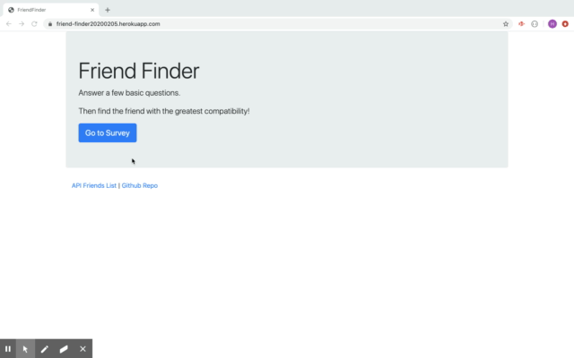

# friend-finder

This heroku supported web app will find the friend with the greatest compatibility after the user answer a few basic questions.

Node.js and module express are used in this app to store the user info in the server, post it on the api/friends page, find the match and display the match's name and photo to the page as a modal.

### Demo of the app

